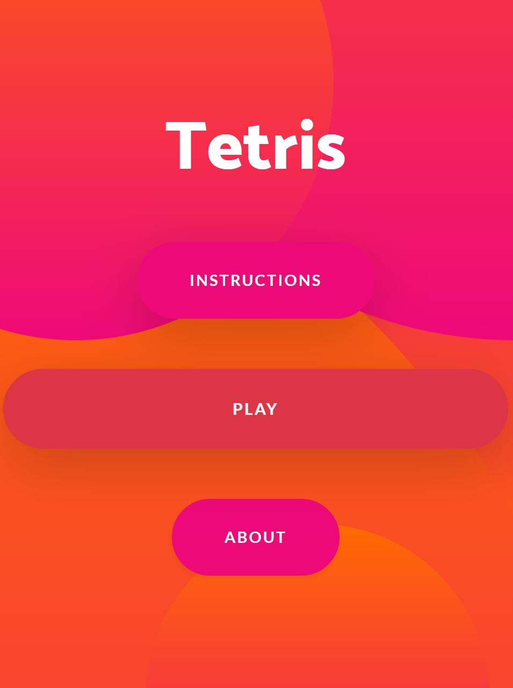
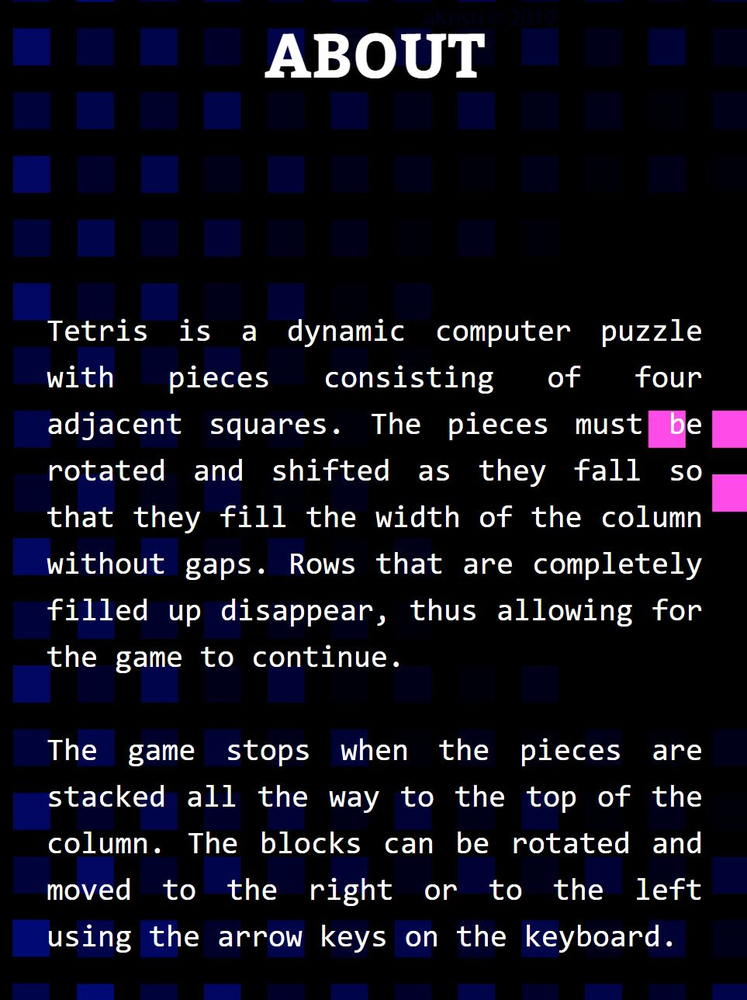
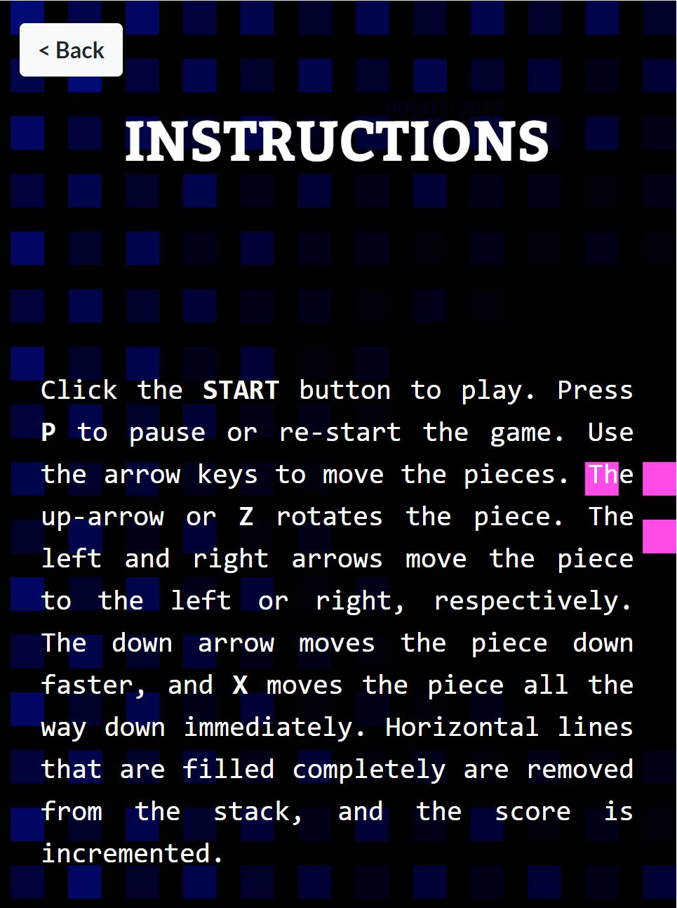
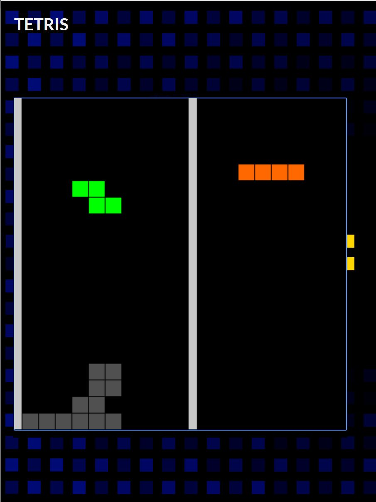

# Tetris App
Tetris is a dynamic computer puzzle with pieces consisting of four adjacent squares. The pieces must be rotated and shifted as they fall so that they fill the width of the column without gaps. Rows that are completely filled up disappear, thus allowing for the game to continue. </strong>  <strong>The game stops when the pieces are stacked all the way to the top of the column. The blocks can be rotated and moved to the right or to the left using the arrow keys on the keyboard.</strong>  

## Application Deployment
1. Open Adobe PhoneGap Build [https://build.phonegap.com/apps]
2. Upload the source code in form of a zip file.
3. Build
4. Download the Android and Windows Application
